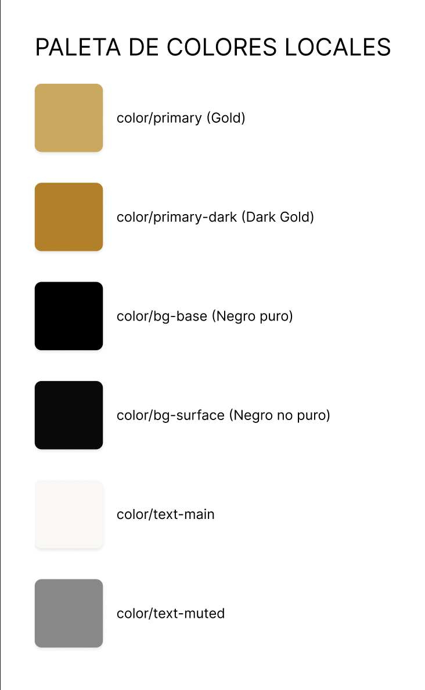
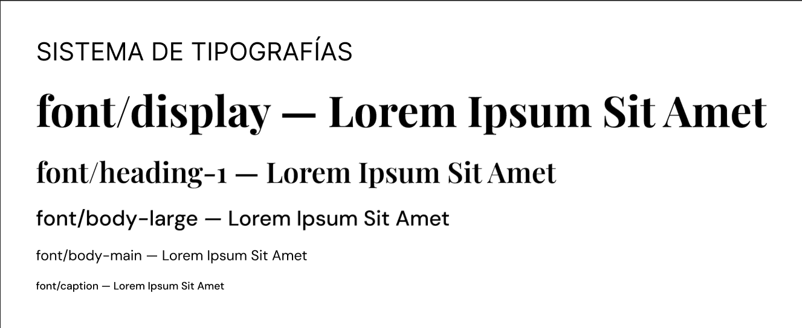
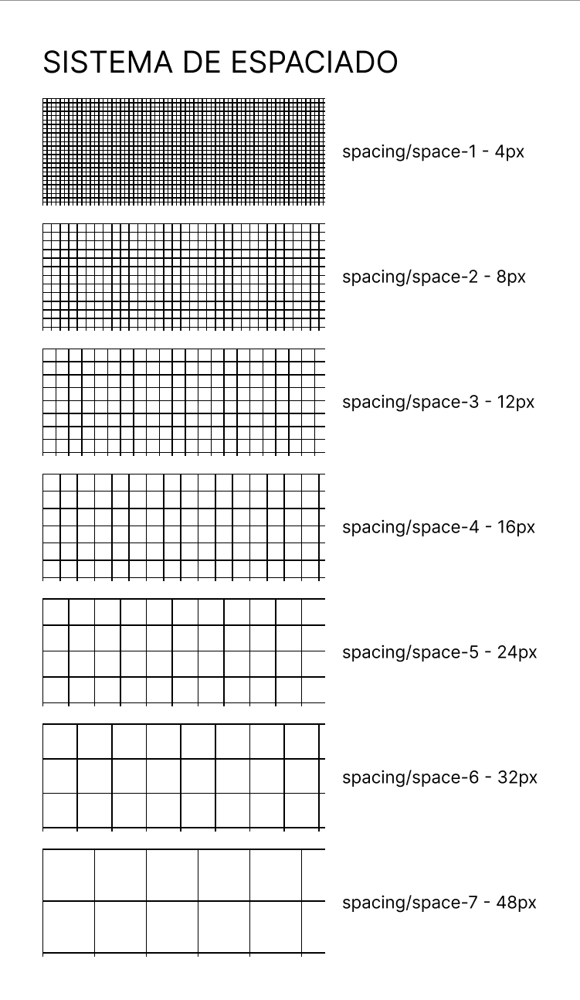
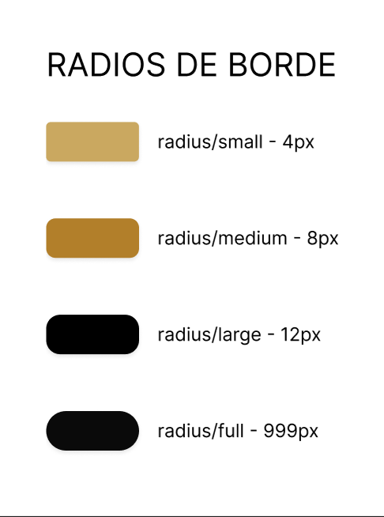
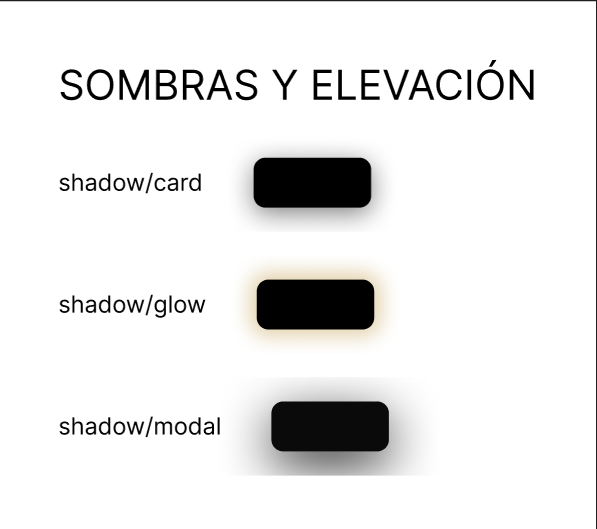
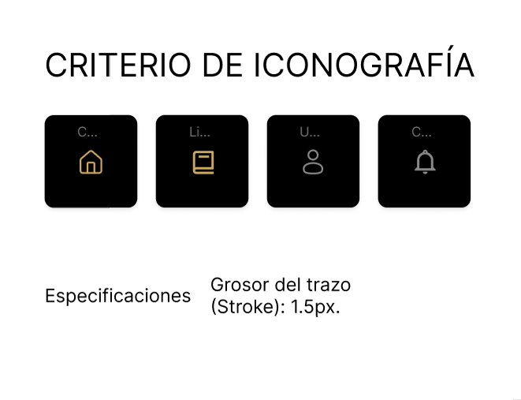
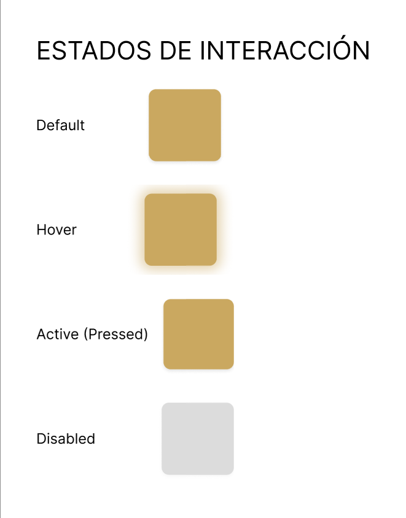
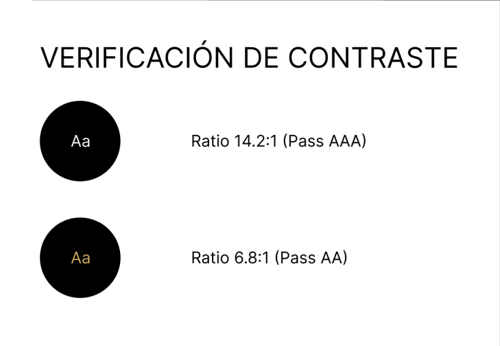

# Kontrol Design Tokens para Figma

## 1. Estructura de Tokens por Categoría

Todos los tokens siguen la estructura `category/token-name` en Figma Tokens.

### COLOR/

#### Primarios
- `color/primary`: #caa860 (Gold - Main brand)
- `color/primary-2`: #b27f2a (Gold - Active/Pressed)
- `color/secondary`: #886911 (Warm accent)

#### Superficies (Dark Mode)
- `color/bg`: rgba(0,0,0,0.92) (Full-page overlay)
- `color/bg-2`: #120f07 (Primary surface - cards, panels)
- `color/bg-3`: #282825 (Secondary depth layer)
- `color/tertiary`: #12120e (Darkened overlay)

#### Bordes
- `color/border`: #312713 (Subtle borders on dark)
- `color/pill-back`: #120f07 (Badge/pill backgrounds)

#### Texto Primario
- `color/text`: #faf8f5 (High-contrast on dark)

#### RGB Triplets (para transparencias)
- `color/primary-rgb`: 202, 168, 96
- `color/error-rgb`: 224, 82, 82
- `color/success-rgb`: 72, 199, 116
- `color/black-rgb`: 0, 0, 0
- `color/white-rgb`: 255, 255, 255

---

### TEXT/ (Rampa de Jerarquía)

Escala descendente de claridad para texto secundario:
- `text/soft`: #cfc9bf (Secundario alto - Labels principales)
- `text/muted`: #8a8070 (Secundario - Labels deshabilitadas) **Neutral, no cálido**
- `text/dim`: #6e6558 (Terciario - Metadata)
- `text/faint`: #565045 (Muy tenue - Deshabilitado)
- `text/placeholder`: #4a4030 (Placeholders en inputs)

---

### VISUALSTATES/

Estados semánticos:
- `visualStates/success-text`: #48c774 (Verde éxito)
- `visualStates/error-text`: #e05252 (Rojo error)

**Nota:** Success y Error backgrounds se usan en tags/badges:
- `color/success`: rgb(15, 77, 15)
- `color/error`: rgb(128, 13, 13)
- `color/warning`: rgb(120, 80, 10)

---

### FORMS/

Estilos específicos de formularios:
- `forms/input-bg`: rgba(255, 255, 255, 0.04) (Input default)
- `forms/input-focus-bg`: rgba(202, 168, 96, 0.05) (Input focused)
- `forms/btn-text`: #0e0c08 (Texto sobre botones gold)

---

## 2. Tipografía

### FONT/

Familias tipográficas:
- `font/display`: "Playfair Display" (Serif - Títulos)
- `font/sans`: "Manrope" (Sans-serif - UI/Body)
- `font/mono`: "JetBrains Mono" (Monospace - Código/KPIs)

### FONTSIZE/

Escala tipográfica (en píxeles):
- `fontSize/display`: 42px (Títulos dashboard principales)
- `fontSize/heading-1`: 24px (Headers, card titles)
- `fontSize/body-large`: 16px (Body text - variante mayor)
- `fontSize/body-main`: 14px (Body text - default)
- `fontSize/caption`: 11px (Captions, pills, metadata)

### FONTWEIGHT/

Pesos disponibles (numéricos):
- `fontWeight/regular`: 400
- `fontWeight/medium`: 500
- `fontWeight/semibold`: 600
- `fontWeight/bold`: 700

### LINEHEIGHT/ y LETTERSPACING/

- `leading/tight`: 1.15 (Headings)
- `leading/snug`: 1.3 (Subheadings)
- `leading/normal`: 1.5 (Body text)
- `tracking/tight`: -0.01em (Headlines)
- `tracking/caps`: 0.08em (Uppercase labels/buttons)

---

## 3. Espaciado (8pt Grid)

### SPACING/

Todos los valores en píxeles (8pt base):
- `space/1`: 4px (Micro gaps)
- `space/2`: 8px (Tight padding - buttons)
- `space/3`: 12px (Field/label spacing)
- `space/4`: 16px (Component padding)
- `space/5`: 24px (Section spacing)
- `space/6`: 32px (Large sections)
- `space/7`: 48px (Major spacing - full-width)

---

## 4. Bordes (Radios)

### RADIUS/

Radios de borde (en píxeles):
- `radius/sm`: 4px (Buttons, small inputs)
- `radius/md`: 8px (Standard cards)
- `radius/lg`: 12px (Modals, large overlays)
- `radius/xl`: 24px (Feature cards)
- `radius/pill`: 999px (Badges, avatars, full-round)

---

## 5. Sombras

### SHADOW/

Efectos de profundidad (sintaxis CSS):
- `shadow/card`: `0 4px 20px 0 rgba(0, 0, 0, 0.5)` (Superficies)
- `shadow/glow`: `0 0 15px 5px rgba(202, 168, 96, 0.5)` (Hover interactivo)
- `shadow/modal`: `0 10px 40px 0 rgba(0, 0, 0, 0.8)` (Top-layer modals)

---

## 6. Estados de Interacción

### STATES/

Modificadores de estado (uso en CSS):
- `state/hover-brightness`: 1.15 → `filter: brightness(1.15)`
- `state/active-scale`: 0.98 → `transform: scale(0.98)`
- `state/disabled-opacity`: 0.3 → `opacity: 0.3`

### FOCUS/

Focus ring:
- `focus-ring-width`: 2px
- `focus-ring-offset`: 2px
- `focus-ring`: `2px solid #caa860`

---

## 7. Iconografía

- **Biblioteca:** Lucide Icons / Heroicons
- **Stroke Weight:** 1.5px (definido como `icon-stroke`)
- **Tamaño estándar:** 24px × 24px
- **Tamaños permitidos:** 24px, 32px, 40px (grid 8pt)
- **Color:** Hereda de `currentColor` (contexto de texto)

---

## 8. Documentación Externa

- Link al Figma file: `https://www.figma.com/design/qDDZC8ZvzDhXHRzDl6bbHi/Kontrol---Identidad-visual-v2?node-id=35-26&t=AQIBKGoAGr8AsFS7-1`
- Link a esta guía: `/frontend/docs/design-system.md`
- Link a tokens JSON: `/frontend/docs/tokens.json`
- Visualización: `./frontend/docs/assets/Kontrol_v2.png`

---

## 9. Referencia visual

> Esta guía acompaña la hoja de referencia visual del sistema y no sustituye la documentación técnica en [`design-system.md`](./design-system.md).

